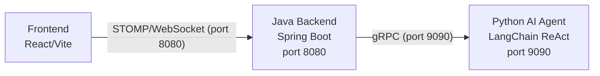

# Texas Hold'em Poker

[中文](./README_CN.md)

A multiplayer Texas Hold'em poker game with an AI-powered opponent system. Features a Java Spring Boot backend, a LangChain ReAct AI agent in Python, and a React frontend.

## Architecture



**Three-tier architecture:**

- **Frontend** -- React 19 + Vite, communicates via STOMP over WebSocket (SockJS)
- **Backend** -- Spring Boot 2.7, manages rooms, orchestrates game flow, enforces rules
- **AI Agent** -- Python 3.11+, LangChain ReAct agent with poker tools and layered memory

## Project Structure

```
texas/
├── poker-core/          # Game engine -- rules, hand evaluation, card/deck models
├── poker-ai/            # AI agents -- heuristic agent + gRPC bridge
├── poker-common/        # Shared protocol messages and protobuf definitions
├── poker-server/        # Spring Boot WebSocket server
├── poker-app/           # Standalone CLI demo (Phase 1 prototype)
├── poker-agent/         # Python LangChain ReAct AI agent (gRPC service)
├── poker-web/           # React + Vite frontend
└── docs/                # API docs, design specs
```

### poker-core

Pure game engine with zero framework dependencies.

| Class | Description |
|-------|-------------|
| `GameEngine` | Core engine -- `startNewHand()`, `applyAction()`, blind logic, side pot calculation |
| `HandEvaluator` | Evaluates best 5-card hand from 7 cards (all hand ranks supported) |
| `GameState` | Immutable game snapshot -- board, players, pot, action history |
| `Action` hierarchy | `FoldAction`, `CheckAction`, `CallAction`, `BetAction`, `RaiseAction`, `AllInAction` |

### poker-ai

AI agent implementations.

| Class | Description |
|-------|-------------|
| `BuiltinAgent` | Interface: `Action decide(GameState, PlayerState)` |
| `SimpleHoldemAgent` | Heuristic agent -- hand strength scoring (pair/suited/gap/high-card bonuses) |
| `GrpcAgentBridge` | Delegates decisions to Python agent via gRPC, falls back to `SimpleHoldemAgent` on failure |
| `HintAdvisor` | Provides fold/call/raise hints to human players |

### poker-common

Shared protocol messages (~20 classes) for WebSocket communication and the protobuf definition (`poker_agent.proto`).

### poker-server

Spring Boot application (port 8080).

| Component | Description |
|-----------|-------------|
| `ClientMessageHandler` | STOMP message controller -- lobby, room, and game actions |
| `GameRoom` | Room lifecycle -- players, chips, ready state, bot management, hand settlement |
| `RoomManager` | Manages all active `GameRoom` instances |
| `BroadcastService` | STOMP message broadcasting |
| `GameStateProjection` | Converts internal state to client-facing view (hides opponent cards) |
| `ReplayRecorder` | Records hand history to `data/replays/` |

### poker-agent

Python LangChain ReAct agent (gRPC service, port 9090).

| Module | Description |
|--------|-------------|
| `agent.react_agent` | Core ReAct agent -- LLM-powered with heuristic fallback |
| `agent.prompt_builder` | Builds prompts for player and advisor modes |
| `agent.output_parser` | Parses LLM output into valid legal actions |
| `tools.hand_evaluation` | Estimates hand strength |
| `tools.pot_odds` | Calculates pot odds and required equity |
| `tools.opponent_modeling` | Opponent behavior analysis |
| `tools.history_analysis` | Action history analysis |
| `memory.manager` | Three-layer memory: hand, opponent, session |
| `grpc.server` | gRPC server implementing `PokerAgent` service |

### poker-web

React frontend with STOMP over WebSocket.

| Component | Description |
|-----------|-------------|
| `App.jsx` | Root -- login, lobby, or game room views |
| `WebSocketContext` | STOMP connection provider |
| `Lobby` | Room list, create/join rooms |
| `Game` | Game table, action bar, bot management |
| `Board` | Community cards and pot display |
| `ActionBar` | Player actions (fold/check/call/bet/raise/all-in) |

## Prerequisites

| Component | Version |
|-----------|---------|
| JDK | 1.8+ |
| Maven | 3.8+ |
| Python | 3.11+ |
| [uv](https://docs.astral.sh/uv/) | Latest |
| Node.js | 18+ |

## Quick Start

### 1. Build Java Backend

```bash
mvn clean install -DskipTests
```

### 2. Start Python AI Agent (gRPC, port 9090)

```bash
cd poker-agent
uv sync
uv run python -m poker_agent.grpc.server --config config/default.yaml --bind 0.0.0.0:9090
```

### 3. Start Java Backend (gRPC mode)

```bash
mvn spring-boot:run -pl poker-server \
  -Dspring-boot.run.arguments='--agent.type=grpc --agent.grpc.host=localhost --agent.grpc.port=9090'
```

Or use simple mode (no Python agent needed):

```bash
mvn spring-boot:run -pl poker-server
```

### 4. Start Frontend

```bash
cd poker-web
npm install
npm run dev
```

Open http://localhost:3000 in your browser.

### Docker Compose (Recommended)

```bash
docker compose up --build
```

This starts all three services:

| Service | URL |
|---------|-----|
| Frontend | http://localhost |
| Backend | http://localhost:8080 |
| AI Agent | localhost:9090 (gRPC) |

Custom LLM configuration:

```bash
LLM_API_KEY=sk-xxx LLM_MODEL=gpt-4o LLM_BASE_URL=https://api.openai.com/v1 docker compose up --build
```

Or create a `.env` file:

```bash
LLM_API_KEY=sk-xxx
LLM_MODEL=gpt-4o
LLM_BASE_URL=https://api.openai.com/v1
LLM_PROVIDER=openai
```

| Variable | Default | Description |
|----------|---------|-------------|
| `LLM_PROVIDER` | `openai` | LLM provider (`openai` / `anthropic` / `ollama` / `custom`) |
| `LLM_MODEL` | `mimo-v2.5-pro` | Model name |
| `LLM_API_KEY` | *(empty)* | API key |
| `LLM_BASE_URL` | `https://token-plan-cn.xiaomimimo.com/v1` | API base URL |

### One-Click Start Script

```bash
#!/bin/bash
set -e

PROJECT_DIR="$(cd "$(dirname "$0")" && pwd)"

echo "=== Starting Python Agent (port 9090) ==="
cd "$PROJECT_DIR/poker-agent"
uv run python -m poker_agent.grpc.server --config config/default.yaml --bind 0.0.0.0:9090 &
AGENT_PID=$!
sleep 2

echo "=== Starting Java Backend (port 8080) ==="
cd "$PROJECT_DIR"
mvn spring-boot:run -pl poker-server \
  -Dspring-boot.run.arguments='--agent.type=grpc --agent.grpc.host=localhost --agent.grpc.port=9090' &
SERVER_PID=$!
sleep 5

echo "=== Starting Frontend (port 5173) ==="
cd "$PROJECT_DIR/poker-web"
npm run dev &
WEB_PID=$!

echo ""
echo "All services started:"
echo "  Frontend:  http://localhost:5173"
echo "  Backend:   http://localhost:8080"
echo "  Agent:     localhost:9090 (gRPC)"
echo ""
echo "Press Ctrl+C to stop all services"

trap "kill $AGENT_PID $SERVER_PID $WEB_PID 2>/dev/null; exit" SIGINT SIGTERM
wait
```

## Configuration

### Agent Config (`poker-agent/config/default.yaml`)

```yaml
name: ProPokerAgent
mode: player
llm:
  provider: openai       # openai / anthropic / ollama
  model: gpt-4o-mini
  # api_key: sk-...      # or set OPENAI_API_KEY env var
  temperature: 0.7
tools:
  hand_evaluation: { enabled: true }
  pot_odds: { enabled: true }
  opponent_modeling: { enabled: true }
  history_analysis: { enabled: true }
memory:
  persistence: file      # memory / file
  file_path: ./data/memory
```

### Backend Config

| Parameter | Default | Description |
|-----------|---------|-------------|
| `agent.type` | `simple` | `simple` for built-in AI, `grpc` for Python agent |
| `agent.grpc.host` | `localhost` | Agent gRPC host |
| `agent.grpc.port` | `9090` | Agent gRPC port |
| `agent.grpc.timeout-ms` | `4000` | Decision timeout (ms), falls back on timeout |

## gRPC Service Definition

```protobuf
service PokerAgent {
  rpc Register(RegisterRequest) returns (RegisterResponse);
  rpc MakeDecision(DecisionRequest) returns (ActionResponse);
  rpc Ping(PingRequest) returns (PingResponse);
}
```

## Ports

| Service | Port | Protocol |
|---------|------|----------|
| Frontend | 5173 | HTTP |
| Backend | 8080 | HTTP / WebSocket (STOMP) |
| AI Agent | 9090 | gRPC |

## API Reference

See [docs/api/server-api.md](docs/api/server-api.md) for the full WebSocket API reference.

## Roadmap

### Near-term (P0)

- [x] Docker Compose deployment
- [x] GitHub Actions CI (Java tests, Python tests, frontend lint)
- [ ] Integration test coverage for server game flow
- [ ] `.env.example` for sensitive configuration

### Mid-term (P1)

- [ ] User authentication / session persistence
- [ ] Game replay viewer (frontend playback of `data/replays/`)
- [ ] Agent decision dashboard -- reasoning logs and win-rate stats
- [ ] Frontend i18n (internationalization)

### Long-term (P2)

- [ ] Advanced agent strategies -- GTO solver, Monte Carlo simulation
- [ ] Multi-model A/B testing -- compare LLM performance at the table
- [ ] WebSocket message authentication / anti-cheat
- [ ] Load testing for multi-room concurrent scenarios

## License

MIT
