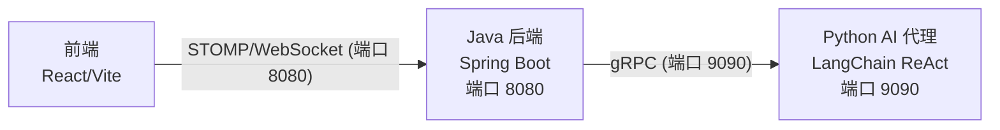

# 德州扑克多人在线游戏

[English](./README.md)

一个支持 AI 对手的多人在线德州扑克游戏。采用 Java Spring Boot 后端、Python LangChain ReAct AI 代理和 React 前端的三层架构。

## 系统架构



**三层架构：**
- **前端** -- React 19 + Vite，通过 STOMP over WebSocket (SockJS) 通信
- **后端** -- Spring Boot 2.7，管理房间、编排游戏流程、执行规则
- **AI 代理** -- Python 3.11+，LangChain ReAct 代理，支持扑克工具和分层记忆

## 项目结构

```
texas/
├── poker-core/          # 游戏引擎 -- 规则、牌型评估、卡牌/牌组模型
├── poker-ai/            # AI 代理 -- 启发式代理 + gRPC 桥接
├── poker-common/        # 共享协议消息和 protobuf 定义
├── poker-server/        # Spring Boot WebSocket 服务器
├── poker-app/           # 独立 CLI 演示（第一阶段原型）
├── poker-agent/         # Python LangChain ReAct AI 代理（gRPC 服务）
├── poker-web/           # React + Vite 前端
└── docs/                # API 文档、设计规范
```

### poker-core -- 游戏引擎

纯游戏引擎，无框架依赖。

| 类 | 说明 |
|----|------|
| `GameEngine` | 核心引擎 -- `startNewHand()`、`applyAction()`、盲注逻辑、边池计算 |
| `HandEvaluator` | 从 7 张牌中评估最佳 5 张牌组合（支持所有牌型） |
| `GameState` | 不可变游戏快照 -- 公共牌、玩家、底池、动作历史 |
| `Action` 体系 | `FoldAction`、`CheckAction`、`CallAction`、`BetAction`、`RaiseAction`、`AllInAction` |

### poker-ai -- AI 代理

AI 代理实现。

| 类 | 说明 |
|----|------|
| `BuiltinAgent` | 接口：`Action decide(GameState, PlayerState)` |
| `SimpleHoldemAgent` | 启发式代理 -- 手牌强度评分（对子/同花/间隔/高牌加成） |
| `GrpcAgentBridge` | 通过 gRPC 将决策委托给 Python 代理，失败时回退到 `SimpleHoldemAgent` |
| `HintAdvisor` | 为人类玩家提供弃牌/跟注/加注提示 |

### poker-common -- 共享协议

约 20 个 WebSocket 通信协议消息类和 protobuf 定义（`poker_agent.proto`）。

### poker-server -- 游戏服务器

Spring Boot 应用（端口 8080）。

| 组件 | 说明 |
|------|------|
| `ClientMessageHandler` | STOMP 消息控制器 -- 大厅、房间和游戏操作 |
| `GameRoom` | 房间生命周期 -- 玩家、筹码、准备状态、Bot 管理、牌局结算 |
| `RoomManager` | 管理所有活跃的 `GameRoom` 实例 |
| `BroadcastService` | STOMP 消息广播 |
| `GameStateProjection` | 将内部状态转换为客户端视图（隐藏对手手牌） |
| `ReplayRecorder` | 记录牌局历史到 `data/replays/` |

### poker-agent -- AI 代理

Python LangChain ReAct 代理（gRPC 服务，端口 9090）。

| 模块 | 说明 |
|------|------|
| `agent.react_agent` | 核心 ReAct 代理 -- LLM 驱动，支持启发式回退 |
| `agent.prompt_builder` | 构建玩家和顾问模式的提示词 |
| `agent.output_parser` | 将 LLM 输出解析为合法动作 |
| `tools.hand_evaluation` | 估算手牌强度 |
| `tools.pot_odds` | 计算底池赔率和所需胜率 |
| `tools.opponent_modeling` | 对手行为分析 |
| `tools.history_analysis` | 动作历史分析 |
| `memory.manager` | 三层记忆：手牌级、对手级、会话级 |
| `grpc.server` | 实现 `PokerAgent` 服务的 gRPC 服务器 |

### poker-web -- 前端

React 前端，通过 STOMP over WebSocket 通信。

| 组件 | 说明 |
|------|------|
| `App.jsx` | 根组件 -- 登录、大厅、游戏房间视图 |
| `WebSocketContext` | STOMP 连接提供者 |
| `Lobby` | 房间列表，创建/加入房间 |
| `Game` | 游戏桌面、操作栏、Bot 管理 |
| `Board` | 公共牌和底池显示 |
| `ActionBar` | 玩家操作（弃牌/过牌/跟注/下注/加注/全押） |

## 环境要求

| 组件 | 版本要求 |
|------|---------|
| JDK | 1.8+ |
| Maven | 3.8+ |
| Python | 3.11+ |
| [uv](https://docs.astral.sh/uv/) | 最新版 |
| Node.js | 18+ |

## 快速开始

### 1. 构建 Java 后端

```bash
mvn clean install -DskipTests
```

### 2. 启动 Python AI 代理（gRPC，端口 9090）

```bash
cd poker-agent
uv sync
uv run python -m poker_agent.grpc.server --config config/default.yaml --bind 0.0.0.0:9090
```

启动后日志应显示：
```
INFO: Starting PokerAgent gRPC server on 0.0.0.0:9090
```

### 3. 启动 Java 后端（gRPC 模式）

```bash
mvn spring-boot:run -pl poker-server \
  -Dspring-boot.run.arguments='--agent.type=grpc --agent.grpc.host=localhost --agent.grpc.port=9090'
```

或使用简单模式（不需要 Python 代理）：

```bash
mvn spring-boot:run -pl poker-server
```

### 4. 启动前端

```bash
cd poker-web
npm install
npm run dev
```

打开浏览器访问 http://localhost:5173

### 一键启动脚本

保存为 `start.sh`：

```bash
#!/bin/bash
set -e

PROJECT_DIR="$(cd "$(dirname "$0")" && pwd)"

echo "=== 1. 启动 Python Agent (端口 9090) ==="
cd "$PROJECT_DIR/poker-agent"
uv run python -m poker_agent.grpc.server --config config/default.yaml --bind 0.0.0.0:9090 &
AGENT_PID=$!
sleep 2

echo "=== 2. 启动 Java 后端 (端口 8080) ==="
cd "$PROJECT_DIR"
mvn spring-boot:run -pl poker-server \
  -Dspring-boot.run.arguments='--agent.type=grpc --agent.grpc.host=localhost --agent.grpc.port=9090' &
SERVER_PID=$!
sleep 5

echo "=== 3. 启动前端 (端口 5173) ==="
cd "$PROJECT_DIR/poker-web"
npm run dev &
WEB_PID=$!

echo ""
echo "=== 所有服务已启动 ==="
echo "  前端:      http://localhost:5173"
echo "  后端:      http://localhost:8080"
echo "  Agent:     localhost:9090 (gRPC)"
echo ""
echo "按 Ctrl+C 停止所有服务"

trap "kill $AGENT_PID $SERVER_PID $WEB_PID 2>/dev/null; exit" SIGINT SIGTERM
wait
```

## 配置说明

### Agent 配置 (`poker-agent/config/default.yaml`)

```yaml
name: ProPokerAgent
mode: player
llm:
  provider: openai       # openai / anthropic / ollama
  model: gpt-4o-mini
  # api_key: sk-...      # 或设置环境变量 OPENAI_API_KEY
  temperature: 0.7
tools:
  hand_evaluation: { enabled: true }
  pot_odds: { enabled: true }
  opponent_modeling: { enabled: true }
  history_analysis: { enabled: true }
memory:
  persistence: file      # memory / file
  file_path: ./data/memory
```

### Java 后端配置

| 参数 | 默认值 | 说明 |
|------|--------|------|
| `agent.type` | `simple` | `simple` 使用内置 AI，`grpc` 使用 Python Agent |
| `agent.grpc.host` | `localhost` | Agent gRPC 地址 |
| `agent.grpc.port` | `9090` | Agent gRPC 端口 |
| `agent.grpc.timeout-ms` | `4000` | 决策超时（毫秒），超时自动回退 |

## gRPC 服务定义

```protobuf
service PokerAgent {
  rpc Register(RegisterRequest) returns (RegisterResponse);
  rpc MakeDecision(DecisionRequest) returns (ActionResponse);
  rpc Ping(PingRequest) returns (PingResponse);
}
```

## 端口一览

| 服务 | 端口 | 协议 |
|------|------|------|
| 前端 | 5173 | HTTP |
| 后端 | 8080 | HTTP / WebSocket (STOMP) |
| AI 代理 | 9090 | gRPC |

## 验证部署

### 检查 Agent 是否就绪

```bash
cd poker-agent
uv run python -c "
import asyncio, grpc
from poker_agent.grpc.generated import poker_agent_pb2 as pb2
from poker_agent.grpc.generated import poker_agent_pb2_grpc as pb2_grpc

async def check():
    channel = grpc.aio.insecure_channel('localhost:9090')
    stub = pb2_grpc.PokerAgentStub(channel)
    resp = await stub.Ping(pb2.PingRequest())
    print(f'Agent OK: {resp.success}, version={resp.server_version}')
    await channel.close()

asyncio.run(check())
"
```

### 完整对局测试

1. 打开 http://localhost:5173
2. 输入昵称进入大厅
3. 创建房间
4. 点击"添加 Bot"添加 AI 玩家
5. 点击"准备" -> "开始"
6. 观察 Bot 使用 Python Agent 做决策（查看后端日志）

## API 文档

完整的 WebSocket API 参考请见 [docs/api/server-api.md](docs/api/server-api.md)。

## 常见问题

**Q: Agent 启动报错 `ModuleNotFoundError: No module named 'poker_agent'`**
A: 确保在 `poker-agent` 目录下使用 `uv run python -m poker_agent.grpc.server` 启动，不要直接运行 `python server.py`。

**Q: Java 后端连接 Agent 超时**
A: 确认 Agent 已在 9090 端口启动。检查防火墙设置。超时后会自动回退到 `SimpleHoldemAgent`。

**Q: 前端无法连接后端**
A: 确认后端在 8080 端口运行。检查 WebSocket 连接地址配置。

## 开源协议

MIT
